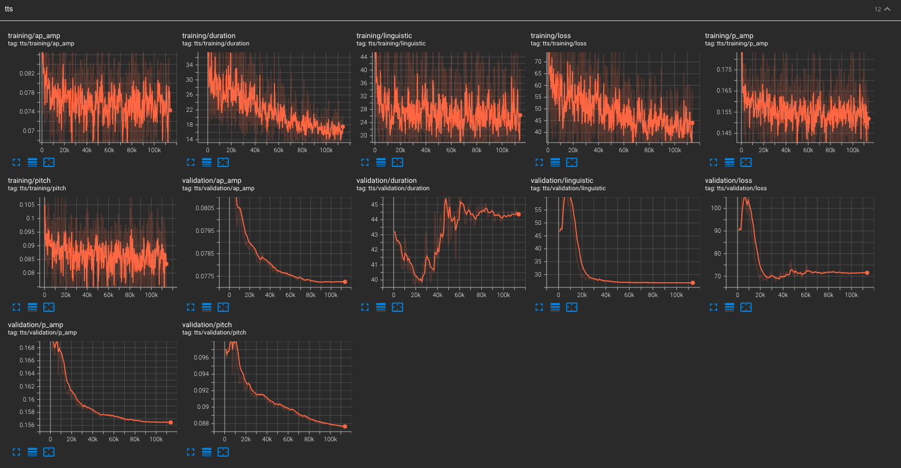

# Text to Speech

## 📚 Quickstart

### Data collect

- HifiTTS: high-resolution multi-speaker english dataset used here as baseline. Can be downloaded [here](https://www.openslr.org/109/).

### Data preprocessing

1.  Generate phonetic alignment using GlowTTS:

    a) Download [GlowTTS model checkpoint](https://drive.google.com/file/d/1JiCMBVTG4BMREK8cT3MYck1MgYvwASL0/view).

    b) Update `GLOW_TTS_CKPT_PATH` in [compute_glowtts_alignments.py](../src/data/preprocessing/compute_glowtts_alignments.py) script.

    c) Prepare a [GlowTTS filelist](https://github.com/jaywalnut310/glow-tts/blob/master/filelists/ljs_audio_text_train_filelist.txt) or use [this example](../static/tts/hi_fi_tts_transcripts.txt) for HiFiTTS dataset (you need to download the dataset first).

    d) Prepare a [GlowTTS config](../glow-tts/configs/base.json), changing:

        - `"training_files"` to your filelist,
        - `"cmudict_path"` to `<nansypp_path>/static/tts/cmu_dictionary`.

    e) Run the alignment script:

    ```bash
    python src/data/preprocessing/compute_glowtts_alignments.py <config_file> <input_dir> <output_dir>
    ```

2.  Decode audio using:

```bash
python src/data/preprocessing/decode.py -i <input_dir> -o <output_dir> -sr 44100
```

3. Compute TTS targets using:

```bash
python -m src.data.preprocessing.precompute_tts_targets \
    <decoded_output_dir>/dataset.csv \
    <sample_rate> \
    <tts_targets_dir> \
    <backbone_exp_dir> \
    <backbone_ckpt_name>
```

4. Train/test split:

```bash
head -n 1001 <tts_targets_dir>/dataset.csv > <tts_targets_dir>/validation_dataset.csv
head -n 1 <tts_targets_dir>/dataset.csv > <tts_targets_dir>/train_dataset.csv
sed -n '1002,$p' tts_targets_dir>/dataset.csv  >> <tts_targets_dir>/train_dataset.csv
```

### Training

1. Edit [TTS training config](../configs/tts/hifitts.yaml): specify `<tts_targets_dir>` and `<alignment_dir>`.

2. Run the training script:

```bash
python src/train/tts.py --config-name=hifitts +trainer.devices=<list_of_gpu_ids>
```

### Checkpoint

Run `download_backbone_ckpt.py` that will download a checkpoint we trained using this repository for 200k training-steps and will place it in the right directory so that following inference and app work smoothly.

```bash
python src/utilities/download_checkpoints.py
```

### Inference

An inferencer class is provided in source code and can be called from command-line as follows:

```bash
python src/inference/tts.py \
<experiment_directory> \
<checkpoint_filename> \
<audio_path> \
<text> \
<output_path> \
-d <device>
```

Example:

```bash
python src/inference/tts.py \
"static/runs/runs_tts/hifitts/2023-10-03_18-23-00" \
"steps=step=15000.ckpt" \
"static/samples/vctk/p238_001.wav" \
"To be or not to be that is the question" \
"static/tmp/to_be.wav"
```

### Streamlit app

```bash
streamlit run app/text_to_speech.py --server.port <port_number>
```

### Logs

Along training you can visualize logs using the following command:

```bash
tensorboard --logdir=static/runs/runs_tts --bind_all --port <port_number>
```



### 🔬 R&D

Observations and key R&D results are detailed [here](./TTS_OBSERVATIONS.md).

## 🎧 Results

Results from checkpoints trained with this repo are showcased on [this Notion page](https://swamp-galliform-240.notion.site/Demo-page-for-NANSY-open-source-repo-b38c9ed2722140bf94c3af454e541d37).
