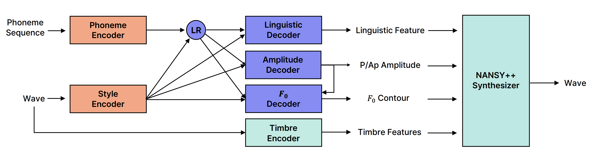
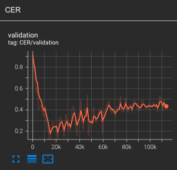

# Text to Speech

**Important Note:** the provided codebase is an attempt to reproduce the results reported by the authors. It does not achieve the same quality of generation.

## Training pipeline

Although the original article provides the architecture of the TTS framework as well as describes the training and inference processes, there are multiple details that are not described.



* The NANSY-TTS model operates based on the following principles:
    - **Text-to-Speech Module**: This component generates linguistic features, pitch, and amplitudes from a given input text, along with a reference voice sample.
    - **Timbre Embedding**: The timbre embedding is extracted from the reference voice sample using the NANSY++ analyzer.
    - **Audio Synthesis**: The NANSY++ synthesizer utilizes the linguistic features, pitch, amplitudes, and timbre embedding to produce the final audio output.

The subsequent sections delve into the specific code elements that implement these logical components.

### Data preparation

1. **Text Encoding**

    To process text for our TTS model, the initial step involves encoding it into a phoneme sequence. This process unfolds as follows:
    
    - **Text Encoding**: We utilize a [text](../src/data/text/) module implemented in the [Tacotron](https://github.com/keithito/tacotron) repository to transform raw text into a phoneme sequence.

    - **Phonetic Alignments**: Phonetic alignments are generated using the GlowTTS model, as detailed in the [text_to_speech.md](../text_to_speech.md#data-preprocessing) document.

    - **[TextProcessor Class](../src/data/text/text_processor.py)**: We employ the `TextProcessor` class to encode text and load alignment files and segments. This class streamlines the data preparation process.

    **[Note]**: In our exploration, we also experimented with using phonetic alignments computed with the wav2vec2 model, aligning individual letters with audio. To accommodate this approach, we employed an alternative TextProcessor. Our findings indicate that phonetic alignment generally results in smoother generation compared to letter-based alignment.

2. **Training Sample Components**

    [A training sample](../src/data/datamodule/tts.py#L25) for TTS module consists of:
    
    - Encoded phoneme sequence.
    - Style audio.
    - Phonetic durations:
        - Used as a target for the amplitude predictor.
        - Used to upsample phoneme features for TTS decoders.
    - NANSY++ analyser output: used as target.

    For [inference](../src/inference/tts.py#L93) purposes, only the encoded phoneme sequence and the style audio are required.

3. **Proposed Datasets**

     We propose 2 datasets for managing TTS data samples. They [require](../src/data/dataset/tts_base.py#L21) information about phonetic alignment (`alignment_file` parameter) and information about Backbone analyser outputs (`dataset_dir` and `descriptor_file` parameters).

    - [TTSBaseDataset](../src/data/dataset/tts_base.py#L13): for each audio sample returns audio segment backbone features for the entire audio. We use it for [validation](../src/dataclasses/tts.py#L32).

    - [TTSTrainDataset](../src/data/dataset/tts_train.py#L19): groups audios by length and for each index returns a list of items of the same length. This way the audio samples and target features have no padding. We use it for [training](../src/dataclasses/tts.py#L42).

 4. Batches are aggregated by a [custom collate function](../src/data/datamodule/tts.py#L68).

### Training details

1. Once the phoneme sequence has been encoded, the training process    proceeds as follows:

    - **Phoneme Duration Prediction**: We predict phoneme durations using an amplitude predictor. These durations have the frame rate of the forced phonetic alignment.

    - **Upsampling Phoneme Features**: Before passing the upsampled phoneme features to the TTS decoders, they must be further upsampled to match the target lengths of linguistic features and pitch.

2. As it is noted in the article's Appendix B.2 Training details for TTS:

    ```
    To train the prosody components efficiently, we apply the min-max normalization for Ap, Aap and F0.
    ```
    
    - **Min-Max Normalisation statistics**: To achieve this, [we compute pitch statistics](../src/data/preprocessing/precompute_tts_targets.py#L134) over the training dataset and [store this information](../src/data/datamodule/tts.py#L32) along with the TTS targets.
    
    - **Decoder Outputs**: Both the [F0 decoder](../src/networks/tts/decoders/f0.py#L84) and [amplitudes decoder](../src/networks/tts/decoders/amplitude.py#L75) predict values within the normalized range of 0 to 1. These normalized values are subsequently [rescaled](../src/networks/tts/tts.py#L148) by the model during processing.

    - **Loss Function**: During loss computation, the [min-max normalisation is applied](../src/losses/tts.py#L40) again.

3. We found that MSE loss for [linguistic features](../src/losses/tts.py#L64) and [duration](../src/losses/tts.py#L79) performs better in our trainings then MAE. We also use some [multiplicator](../src/losses/tts.py#L25) for linguistic features as we found that they tend to have very small values ($\sim 10^{-4}$). Thus TTS loss consists of 3 parts:

    - MSE of linguistic features,
    - MAE on Ap, Aap and F0 after min-max normalisation,
    - MSE of phoneme durations.

**[Note]** The training loss is a [weighted sum](../src/dataclasses/tts.py#L221) of these three components, and we emphasize that the choice of weights for these loss components can significantly impact training results. Careful adjustment of these weights may be required to achieve optimal model performance.

### Evaluation

To evaluate the quality of speech generation we have implemented [TTSEvaluationModule](../src/utilities/tts_evaluation.py#L18). This module operates based on a JSON file containing pairs of `<audio_path>: <text>`. It generates speech from the provided text using our model. Subsequently, we employ [Whisper](https://huggingface.co/docs/transformers/model_doc/whisper) for speech recognition, which enables us to calculate the Character Error Rate (CER), our primary evaluation metric.

These CER results are not directly comparable with the results reported by the authors of the article as their validation set is not disclosed as well as the algorithm used for speech recognition.

### Experiments

We provide a TTS model trained based on the Backbone model described in the Backbone section. The resulting CER plot is attached below.



The entire training took 15 hours on 1 A5000 GPU. We see that the best quality of 9.7% CER is attained at 15k steps (2 hours of training). 

### Results

Results from checkpoints trained with this repo are showcased on [this Notion page](https://swamp-galliform-240.notion.site/Demo-page-for-NANSY-open-source-repo-b38c9ed2722140bf94c3af454e541d37).